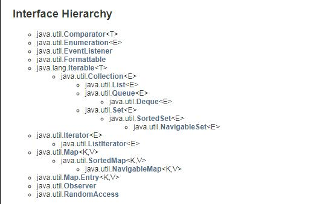

  1. java 集合




* Comparator:比较接口。

* Iterable：可迭代的。方法返回迭代器

  ```java
  /**Returns an iterator over a set of elements of type T.
  Returns:
  an Iterator.*/
  Iterator<T> iterator()
  ```

* Iterator :迭代器。数组、list、queue都会用到

  - #### hasNext

    ```
    boolean hasNext()
    ```

    Returns `true` if the iteration has more elements. (In other words, returns `true` if [`next()`](http://tool.oschina.net/uploads/apidocs/jdk_7u4/java/util/Iterator.html#next()) would return an element rather than throwing an exception.)

    - Returns:

      `true` if the iteration has more elements


  - #### next

    ```
    E next()
    ```

    Returns the next element in the iteration.

    - Returns:

      the next element in the iteration

    - Throws:

      `NoSuchElementException` - if the iteration has no more elements


  - #### remove

    ```
    void remove()
    ```

    Removes from the underlying collection the last element returned by this iterator (optional operation). This method can be called only once per call to [`next()`](http://tool.oschina.net/uploads/apidocs/jdk_7u4/java/util/Iterator.html#next()). The behavior of an iterator is unspecified if the underlying collection is modified while the iteration is in progress in any way other than by calling this method.

    - Throws:
      `UnsupportedOperationException` - if the `remove` operation is not supported by this iterator

      `IllegalStateException` - if the `next` method has not yet been called, or the `remove` method has already been called after the last call to the `next` method

* LIstIterator : 线性的迭代器 增加了 set、add、next index、**hasPrevious**()、previous、previousIndex等方法

* EventListener : A tagging interface that all event listener interfaces must extend.(注解、优缺点)//非集合类

